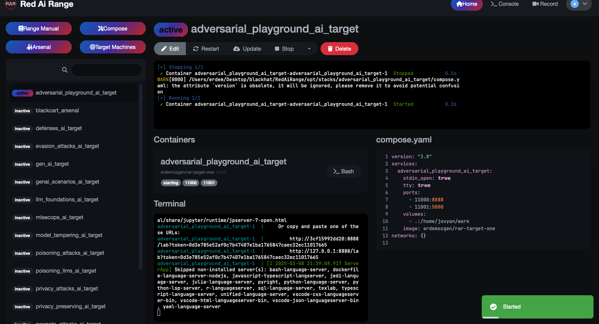

# Red AI Range (RAR)

## Overview

Red AI Range (RAR) is a comprehensive security platform designed specifically for AI red teaming and vulnerability assessment. It creates realistic environments where security professionals can systematically discover, analyze, and mitigate AI vulnerabilities through controlled testing scenarios.

As organizations increasingly integrate AI systems into critical infrastructure, the need for robust security testing has become essential. RAR addresses this need by providing a standardized framework that consolidates various AI vulnerabilities in one accessible environment for both academic research and industrial security operations.

## Core Capabilities

### Red Team Operations Support

RAR serves as a complete operational platform for red teams focused on AI security. It enables teams to:

- Conduct systematic assessments of AI system security boundaries
- Simulate sophisticated attack scenarios against production-like environments
- Document and report findings in a standardized format
- Train new team members on AI-specific attack vectors
- Develop custom testing methodologies for proprietary AI systems
- Validate the effectiveness of security controls and mitigations

### Containerized Architecture

Due to the inherent complexity of AI libraries and their dependencies, RAR implements a sophisticated Docker-based architecture. This approach resolves the nearly impossible task of installing multiple, often conflicting AI frameworks in a single environment. The containerized structure:

- Isolates conflicting dependencies between different AI frameworks
- Maintains consistent testing environments across deployments
- Enables rapid reset of testing environments to baseline configurations
- Supports parallel testing of multiple vulnerability types

### Advanced Stack Management System

RAR features a specialized stack management system that streamlines the preparation and deployment of Docker containers. The system includes dedicated configuration areas for:

- Vulnerable AI system deployment specifications
- Testing tool configuration and deployment parameters
- Automatic generation of docker-compose files with appropriate networking
- Environment variable management for secure credential handling

Each configuration area guides users through the proper setup of either vulnerability targets or testing tools, ensuring consistent deployments.

### Intuitive Deployment Controls

The platform offers streamlined deployment options through a user-friendly interface:

- **Arsenal Button**: Deploys containers with security testing tools, vulnerability scanners, and exploitation frameworks necessary for comprehensive AI security assessment (appends "_arsenal" to stack name for clear identification)
- **Target Button**: Deploys containers with intentionally vulnerable AI systems configured for specific testing scenarios (appends "_ai_target" to stack name)
- **Compose Button**: Creates test stacks without name modifications for development and customization purposes

### Remote Agent Architecture

RAR includes a sophisticated agent system that enables connections to remote RAR installations using secure authentication mechanisms. This distributed architecture allows security teams to:

- Leverage specialized hardware resources (such as GPU clusters for testing compute-intensive AI vulnerabilities)
- Coordinate testing activities across geographically distributed teams
- Centralize control of multiple testing environments from a single management console
- Deploy specialized testing environments on cloud platforms when needed

For example, teams can connect to an AWS-hosted RAR instance with GPU resources to test vulnerabilities in large language models that require significant computational power, all controlled through a unified interface.

### Comprehensive Recording Capabilities

The platform includes built-in session recording functionality that supports knowledge transfer and documentation requirements:

- High-quality video capture of testing sessions
- Timestamped activity logging for detailed review
- Secure storage and download options for training materials
- Customizable recording parameters for different documentation needs

This feature is particularly valuable for creating training materials and maintaining documentation of vulnerability demonstrations for stakeholders.

### Docker-in-Docker Implementation

RAR operates as a Docker container while controlling other Docker containers through the Docker socket mounted as a volume. This sophisticated architecture provides numerous advantages:

- **Enhanced Isolation**: Each testing component operates in a strictly controlled environment
- **Precise Resource Management**: Computing resources can be allocated specifically to the needs of individual test scenarios
- **Efficient Cleanup**: Testing environments can be destroyed without residual artifacts
- **Version Control**: Specific versions of AI frameworks can be maintained for consistent vulnerability reproduction
- **Parallel Operations**: Multiple testing scenarios can be executed simultaneously without interference
- **Simplified Deployment**: Complex installation procedures are encapsulated within container definitions
- **Cross-Platform Consistency**: Testing environments remain consistent regardless of the host system

## Applications and Use Cases

RAR serves as a centralized platform for security professionals across various domains:

### For Security Researchers
- Systematic exploration of novel AI attack vectors
- Controlled testing of theoretical vulnerabilities
- Development of new detection and mitigation techniques
- Publication of reproducible security findings

### For Corporate Security Teams
- Validation of AI system security before production deployment
- Regular security assessments of deployed AI systems
- Training and skill development for security personnel
- Demonstration of security capabilities to stakeholders

### For Educational Institutions
- Hands-on training in AI security principles
- Practical workshops on emerging AI threats
- Research into fundamental AI security challenges
- Development of standardized AI security curricula

## Getting Started

# Red AI Range (RAR) Dashboard Overview

The Red AI Range (RAR) dashboard provides a comprehensive user interface designed to simplify AI security testing and vulnerability assessment. This centralized interface supports streamlined deployment and management of various security scenarios and operational tools.

## Main Components

### Top Navigation
- **Range Manual**: Access detailed documentation and guidelines.
- **Compose**: Deploy custom testing stacks or environments.
- **Arsenal**: Launch security assessment tools and exploitation frameworks.
- **Target Machines**: Set up intentionally vulnerable AI targets for testing.

### Activity Status Overview
The dashboard prominently displays the status of the deployed environments:
- **Active**: Number of environments currently running.
- **Exited**: Number of environments recently terminated.
- **Inactive**: Number of available but not currently deployed environments.

### Environment Management
Each AI security scenario can be rapidly managed through the following controls:
- **Docker Run**: Quickly execute Docker commands for selected environments.
- **Convert to Compose**: Transform running environments into reusable docker-compose files.
- **Convert to Target/Arsenal**: Categorize and deploy environments either as a target machine (for vulnerability testing) or as an arsenal tool (for security assessments).

### AI Security Scenarios List
The left-hand pane displays various predefined AI security scenarios, including but not limited to:
- Adversarial Playground
- Blackcart Arsenal
- Defense AI Target
- Evasion Attacks
- Gen AI Target
- Model Tampering
- Privacy Attacks

### Agent Control Panel
Manage and monitor connected remote agents:
- Easily add new agents.
- View current agent connectivity status.

## Contributing

Please see [here](./CONTRIBUTING.md)

# Red AI Range (RAR) - Comprehensive Training Modules

## Module 1: Foundations of AI Security
- **AI/ML Fundamentals**
  - Understanding AI and Machine Learning
  - Types of ML and the ML lifecycle
  - Key algorithms in ML
  - Neural networks and deep learning
  - ML development tools

- **Building Secure Development Environments**
  - Setting up development environments
  - Python and dependency management
  - Virtual environments for AI security
  - Working with Jupyter notebooks
  - Hands-on baseline ML implementations
  - Simple neural network implementations
  - ML development at scale (Google Colab, AWS SageMaker, Azure ML)

- **Security Essentials for AI Systems**
  - Security fundamentals for AI
  - Threat modeling for AI systems
  - Risk assessment and mitigation strategies
  - DevSecOps for AI development
  - Host security in AI environments
  - Network protection for AI systems
  - Authentication mechanisms
  - Data protection techniques
  - Access control implementation
  - Securing code and artifacts

## Module 2: Model Development Attacks

- **Poisoning Attack Techniques**
  - Basics of poisoning attacks
  - Poisoning attack taxonomies
  - Staging simple poisoning attacks
  - Creating poisoned samples
  - Backdoor poisoning attacks
  - Hidden-trigger backdoor attacks
  - Clean-label attacks
  - Advanced poisoning techniques
  - Mitigations and defenses
  - Anomaly detection for poisoning protection
  - Robustness testing against poisoning
  - Advanced poisoning defenses with ART
  - Adversarial training strategies

- **Model Tampering Techniques**
  - Backdoor injection using serialization
  - Trojan horse injection with Keras Lambda layers
  - Custom layer-based Trojan horses
  - Neural payload injection techniques
  - Edge AI attacks
  - Model hijacking strategies
  - Trojan horse code injection
  - Model reprogramming techniques
  - Defense strategies against tampering

- **Supply Chain Attacks**
  - Traditional supply chain risks in AI
  - Vulnerable components in AI systems
  - Securing AI from vulnerable dependencies
  - Private repository configuration
  - Software Bill of Materials (SBOM) implementation
  - Transfer learning security risks
  - Model poisoning in pre-trained models
  - Model tampering in supply chains
  - Secure model provenance and governance
  - MLOps and private model repositories
  - Data poisoning in supply chains
  - Sentiment analysis manipulation techniques

## Module 3: Attacks on Deployed AI

- **Evasion Attack Techniques**
  - Fundamentals of evasion attacks
  - Reconnaissance for evasion attacks
  - Perturbation techniques for images
  - One-step perturbation with FGSM
  - Basic Iterative Method (BIM)
  - Jacobian-based Saliency Map Attack (JSMA)
  - Carlini and Wagner (C&W) attack
  - Projected Gradient Descent (PGD)
  - Adversarial patches - physical and digital
  - NLP evasion with TextAttack
  - Universal Adversarial Perturbations (UAPs)
  - Black-box attacks and transferability
  - Defenses against evasion attacks
  - Adversarial training implementation
  - Input preprocessing strategies
  - Model hardening techniques
  - Model ensemble approaches
  - Certified defense implementation

- **Privacy Attacks - Model Theft**
  - Understanding privacy attacks
  - Model extraction methodologies
  - Functionally equivalent extraction
  - Learning-based model extraction
  - Generative student-teacher extraction (distillation)
  - Practical extraction against CIFAR-10 CNN
  - Defense and mitigation strategies
  - Detection measures for model theft
  - Model ownership identification and recovery

- **Privacy Attacks - Data Theft**
  - Model inversion attack techniques
  - Exploiting model confidence scores
  - GAN-assisted model inversion
  - Practical model inversion demonstrations
  - Inference attack methodologies
  - Attribute inference attacks
  - Meta-classifier implementation
  - Poisoning-assisted inference
  - Membership inference attacks
  - Statistical thresholds for ML leaks
  - Label-only data transferring
  - Blind membership inference
  - White-box attack techniques
  - Practical defenses and mitigations

- **Privacy-Preserving AI**
  - Privacy-preserving ML fundamentals
  - Data anonymization techniques
  - Advanced anonymization strategies
  - K-anonymity implementation
  - Geolocation data anonymization
  - Rich media anonymization
  - Differential privacy (DP) implementation
  - Federated learning (FL) approaches
  - Split learning for privacy
  - Advanced encryption for ML
  - Secure multi-party computation
  - Homomorphic encryption techniques
  - Practical privacy-preserving ML implementation

## Module 4: Generative AI Security

- **Generative AI Fundamentals**
  - Introduction to generative AI
  - Evolution of generative AI technologies
  - GANs implementation techniques
  - Developing GANs from scratch
  - WGANs and custom loss functions
  - Working with pre-trained GANs
  - Pix2Pix and CycleGAN implementation
  - BigGAN and StyleGAN implementation

- **GAN Security - Deepfakes and Attacks**
  - Deepfake creation and detection
  - StyleGAN for synthetic images
  - GAN-based image manipulation
  - Video and animation synthesis
  - Voice deepfake technologies
  - Deepfake detection techniques
  - GAN-based face verification evasion
  - Biometric authentication attacks
  - Password cracking with GANs
  - Malware detection evasion
  - GANs in cryptography and steganography
  - Web attack payload generation
  - Adversarial attack payload generation
  - GAN security implementation
  - Defenses against deepfakes and misuse

- **LLM Security Fundamentals**
  - Introduction to LLMs
  - Developing applications with LLMs
  - Python implementation with LLMs
  - LangChain implementation
  - Data integration with LLMs
  - LLM impact on adversarial AI

- **Prompt Injection Attacks**
  - Adversarial inputs and prompt injection
  - Direct prompt injection techniques
  - Prompt override strategies
  - Style injection methods
  - Role-playing attacks
  - Impersonation techniques
  - Advanced jailbreaking methods
  - Gradient-based prompt injection
  - Data integration risks
  - Indirect prompt injection
  - Data exfiltration via prompt injection
  - Privilege escalation with LLMs
  - Remote code execution via prompts
  - Platform-level defensive measures
  - Application-level defensive strategies

- **LLM Poisoning Techniques**
  - Poisoning embeddings in RAG systems
  - Embedding generation poisoning
  - Direct embeddings poisoning
  - Advanced embeddings poisoning
  - Query embeddings manipulation
  - Defense strategies for RAG
  - Fine-tuning poisoning techniques
  - Fine-tuning attack vectors
  - Practical attacks against commercial LLMs
  - Defenses for fine-tuning security

- **Advanced Generative AI Attacks**
  - Supply-chain attacks in LLMs
  - Model repository poisoning techniques
  - Model tampering on distribution platforms
  - Privacy attacks against LLMs
  - Training data extraction from LLMs
  - Inference attacks against LLMs
  - Model cloning techniques
  - Defense strategies for advanced attacks

## Module 5: Defensive Strategies and Operations

- **Secure-by-Design AI**
  - Secure-by-design AI principles
  - Building AI threat libraries
  - Traditional cybersecurity integration
  - AI-specific attack taxonomy
  - Generative AI attack vectors
  - Supply chain attack prevention
  - Industry AI threat taxonomy mapping
  - NIST AI taxonomy implementation
  - MITRE ATLAS framework integration
  - Threat modeling methodologies for AI
  - Practical AI threat modeling
  - Risk assessment and prioritization
  - Security design implementation
  - Testing and verification strategies
  - Shifting left in AI development
  - Operational security monitoring
  - Trustworthy AI implementation

- **MLSecOps Implementation**
  - The MLSecOps imperative
  - MLSecOps 2.0 framework implementation
  - Orchestration options for security
  - MLSecOps patterns and best practices
  - Building MLSecOps platforms
  - Model sourcing and validation workflows
  - LLMOps security integration
  - Advanced MLSecOps with SBOMs
  - Continuous security testing

- **Enterprise AI Security**
  - Enterprise security challenges
  - Foundations of enterprise AI security
  - Security framework implementation
  - Operational AI security strategies
  - Iterative enterprise security approaches
  - Maturity assessment
  - Governance implementation
  - Regulatory compliance